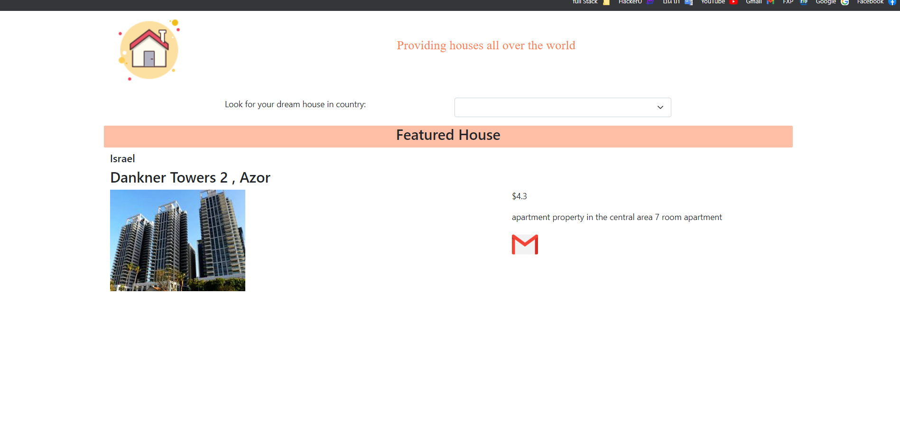
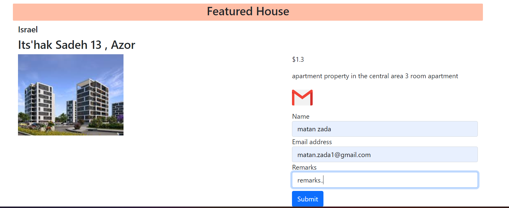

# Real Estate

# Screenshot

- Each refresh of the application will bring a photo + information (country, address, photo, price, description)
  Of the same city + street and house photography
  

  - Clicking on the email icon will open a form for sending data
    

- Range of houses in Israel
- React app
- First rule of hooks - useEffect, useState, useMemo,useParams
- react-router-dom

**useEffect:** What does useEffect do? By using this Hook, we tell the reaction that your component needs to do something after rendering. React will remember the function you passed (we will refer to this as our effect), and call it after performing the DOM updates. In this effect, we set the page title, but we can additionally retrieve information or call another necessary API.

**useState:** What is a Hook? Hook is a special function that allows you to "connect" to React features. For example, useState is a hook that lets you add state to functional components. We will learn about other hooks later.

**useMemo:** Returns the value returned from the function,Most often uesMemo will be used to avoid heavy runs of component performance. While useCallback will be in specific cases of combined cases and transitions of between different components.

**useParams:** The useParams hook returns an object of key/value pairs of the dynamic params from the current URL that were matched by the <Route path>. Child routes inherit all params from their parent routes.
